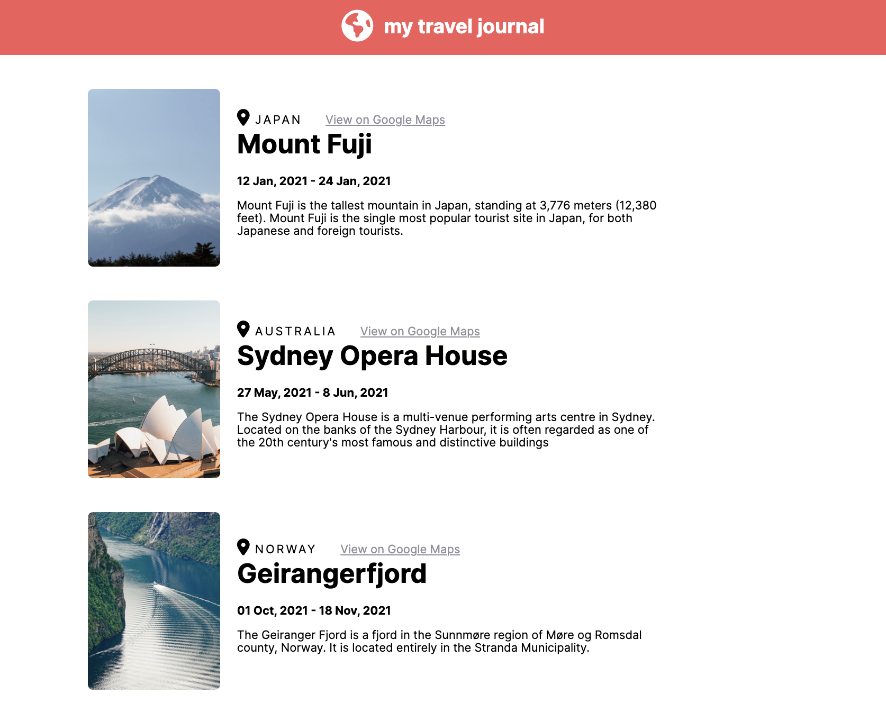

# Travel Journal
Scrimba Solo Project as part of the Learn React Course.  The objective was to practice using props and mapping over data to create an array of JSX elements.

## [Figma design link](https://www.figma.com/file/QG4cOExkdbIbhSfWJhs2gs/Travel-Journal?node-id=0%3A1)

## Requirements
- Data array in a separate .js file
        Title, location, Google Maps, link, start date, end date, description, image URL
- use .map() and props
- style and polish

## Dependencies
- create-react-app
- font awesome for icons

## My experience:
Great simple project to focus just on props and using .map()

